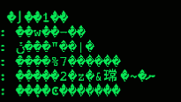

# MHTSv5

**Komande:**  
**/hide** - sakrije ti chat 
**/show** - ako je sakriven otkrije chat 
**/msg0** - bez notifikacija 
**/msg1** - sa gui notifikacijama 
**/msg2** - sa zvucnim notifikacijama 
**/exit** - diskonnekt 
**/clear** - obrisi ekran isto kao clear u terminalu 
**/scan** - skeniraj ko je online i kad je poslednji put bio 
`/poke <User>` - isto kao na fejsu 
`/img [PATH]` - posalji slikui display kad stigne 
`/file [PATH]` - posalji fajl i sacuvaj u folder kad stigne 
`/nc_msg ""` - posalji neku poruku iz navodnika onima sto nemaju tcpc a pokusavaju da pristupe

Da bi mogao da skidas ovaj apk iz terminala kad se apdejtuje, uradi ovo: 
1.Napravi folder negde u filesystemu 
2.Udji u taj folder sa cd 
3.Ukucaj: git clone https://github.com/mirkonikic/MHTS 
4.Sad samo sl put kad budes hteo da apdejtujes apk jer mi se promenio ip, samo idi u taj folder i ukucaj: 
git pull origin master 

ovde sam nasao ovo gore: 
https://docs.gitlab.com/ee/gitlab-basics/start-using-git.html 

>`Uskoro:`
- [x] Dodati XOR i ROT13 enc.
- [ ] Dodati AES enc.
- [x] Izmisli neku svoju enkripciju padded enc.
- [x] Popravi hide komandu
- [x] Dodati /scan (da vidis ko je online i posl put aktivan) 
- [ ] Dodati /poke (kao fejs mozda) komande
- [ ] Dodati /file da salje fajl sa nekog patha i cuva ga u folder
- [ ] Dodati /image da posalje sliku, display je i obrise
- [ ] Dodati /nc_msg "" da posalje iz navodnika ne enkriptovano nc botu
- [ ] Napraviti deb package na apt-get install mhtc?
- [ ] Nova nit za login

`Ovako izgleda poruka kad je enkriptovana:` 

